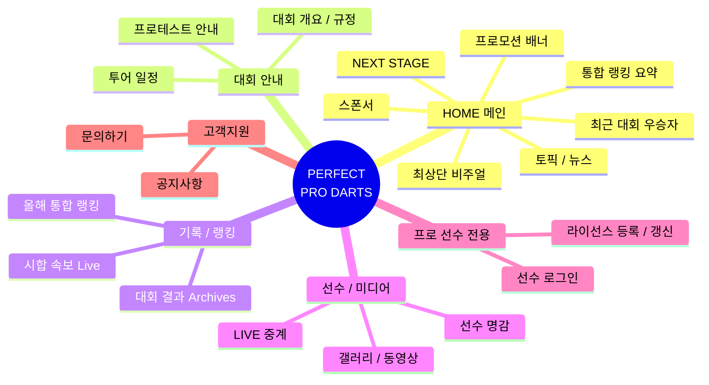

# JAPAN PRO DARTS 공식 웹사이트 UI 리뉴얼 기획안 (다크 모드)

현재 웹사이트의 정보 위계(계층 구조)는 유지하되, 주 사용자인 **프로 선수들**의 니즈(본인 랭킹/포인트 확인, 스폰서 노출)에 완벽히 부합하는 **프리미엄 다크 모드 대시보드 형태**로 리뉴얼하는 시나리오입니다.

## 🎯 핵심 타겟 및 목표 (Target & Objectives)
- **주요 사용자**: 일반 팬이 아닌, 프로 투어에 참가하는 **프로 선수들**.
- **핵심 니즈**: 
  1. 내 현재 랭킹과 포인트는 몇 점인가?
  2. 나와 경쟁자들의 스폰서는 어디인가? (스폰서 로고의 명확한 노출)
  3. 다음 대회(NEXT STAGE) 일정과 참가 신청(엔트리)은 어떻게 하는가?
- **디자인 컨셉**: 프로페셔널, 고급스러움(Premium), 데이터 중심(Data-driven), 네온/글래스모피즘(Glassmorphism) 포인트가 가미된 세련된 다크 테마.

---

## 🏗️ UI/UX 구조 개편 시나리오 (PERFECT 리뉴얼 x 다트라이브 위계)

> **💡 "리뉴얼인데 위계를 똑같이 하라는 게 무슨 말인가요?"**
> 쉽게 비유하자면 **"뼈대(위계)는 그대로 두고, 옷(UI/UX)만 최고급 정장으로 갈아입힌다"**는 뜻입니다!
> 즉, 스크롤을 내릴 때 정보가 나오는 **순서(비주얼 → 다음대회 → 랭킹...)**는 일본 유저들에게 익숙한 다트라이브(JAPAN)의 방식을 100% 차용하여 낯설지 않게(보수적인 성향 만족) 만들되, 눈에 보이는 **디자인(다크 모드, 여백, 애니메이션, 폰트)**은 2026년 최신 트렌드에 맞게 완전히 새롭게 리뉴얼한다는 전략입니다.

### 🗺️ 전체 사이트 IA (Information Architecture) 구조도
메인 페이지 스크롤뿐만 아니라, **웹사이트 전체의 메뉴(GNB)와 하위 페이지 구조**를 다트라이브(JAPAN)의 선진적인 위계에 맞춰 재구성한 전체 IA 맵입니다.

* **포인트**: 기존 PERFECT 사이트에 중구난방 흩어져 있던 메뉴들을 **[대회 안내], [기록/랭킹], [선수/미디어], [프로 선수 전용]** 이라는 직관적인 그룹으로 묶어 선수들이 원하는 메뉴를 1초 만에 찾을 수 있게 IA를 정립했습니다.

### 1. 비주얼 (최상단 메인 이미지)
- 꽉 차는 와이드 비율의 고화질 이미지(예: 심판 뒷모습, 현장 사진) 배치.
- 텍스트 오버레이를 최소화하여 묵직하고 프로페셔널한 첫인상 전달.

### 2. 다음 대회 (NEXT STAGE)
- 비주얼 바로 아래에 띠(Band) 형태나 가로로 넓은 카드 형태로 배치.
- 기존 좌측 사이드바에 갇혀있던 정보를 중앙으로 꺼내어 시인성 확보. (대회명, 날짜, 장소, 엔트리 리스트 버튼)

### 3. 배너 (프로모션 / 이벤트)
- 'JAPAN ELITE 360' 같은 주요 프로모션 배너.
- 다크 배경에 맞게 테두리를 부드럽게 처리하거나 와이드하게 삽입.

### 4. 이전 대회 순위 (STAGE 8 WINNER)
- 직전 대회의 남/녀 우승자 및 순위.
- 선수 얼굴, 이름, 포인트, 그리고 **스폰서 로고**가 명확히 보이도록 깔끔한 그리드 적용. 1위는 황금색 왕관 아이콘 유지.

### 5. 올해 통합 랭킹 (2026 RANKING)
- 프로 선수들의 가장 핵심 니즈.
- 기존 표 형태를 유지하되, 다크 배경 + 화이트 텍스트 + 브랜드 컬러 화살표(UP/DOWN)를 사용하여 가독성 극대화. 스폰서 뱃지는 입체감 있게 처리.

### 6. 토픽 (TOPICS / NEWS)
- 기존 게시판 형태에서 크게 벗어나지 않는 리스트 또는 카드형 레이아웃.
- 공지사항과 뉴스를 분리하여 정갈하게 배치.

### 7. 스폰서 (SPONSOR)
- 등급별(Special, Official 등) 분류 유지.
- 검은 배경 위에 로고들을 배치하여 촌스럽지 않고 고급스럽게 연출 (흑백 톤 다운 후 마우스 오버 시 컬러 팝업 효과 적용 고려).

### 8. 푸터 (FOOTER)
- 로고, 카피라이트, 정책 링크 등을 담은 심플한 다크 푸터.

---

## 🛠️ 개발 진행 단계 (Implementation Steps)

1. **디자인 시스템 구축**: 다크 모드용 컬러 팔레트(Deep Black, Dark Gray, Brand Red/Blue), 타이포그래피(가독성 높은 모던 폰트) 정의.
2. **레이아웃 뼈대 잡기**: 좌측 사이드바 구조를 통합하거나 유지하면서 메인 와이드 해상도에 맞게 재배치 (HTML/CSS 골격).
3. **컴포넌트 개발**: 
   - 랭킹 리더보드 컴포넌트 (포인트 및 스폰서 로고 강조)
   - 네비게이션 및 NEXT STAGE 카드 컴포넌트
4. **스타일링 및 애니메이션**: CSS를 활용하여 프리미엄 다크 느낌을 내는 그라데이션, 그림자, Hover 효과 적용.

---

## 🙋‍♂️ 리뷰 요청 (User Review Required)

> [!IMPORTANT]
> 본격적인 코드 작성을 시작하기 전에 다음 사항을 확인해 주세요.
> 
> 1. **기술 스택**: 현재 프론트엔드 프레임워크(React, Vue 등)를 사용하여 데모 웹앱으로 구현할까요? 아니면 순수 HTML/CSS/JS 파일로만 구현할까요?
> 2. **포인트 컬러**: 다크 배경(검정/짙은 회색)에 어울리는 포인트 컬러(로고의 빨간색/파란색 중 하나)를 메인으로 사용할 계획입니다. 선호하시는 색상이 있나요?
> 3. 제시해 드린 UI 재배치 시나리오가 마음에 드신다면 승인(Proceed)해 주세요. 바로 첫 번째 페이지(Index) 코딩을 시작하겠습니다!
