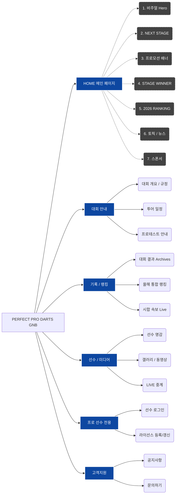

# Page Plan (페이지 기획 및 전체 IA)

## 1. 사이트맵 (Sitemap)

## 2. 주요 페이지 구성 의도
기존 PERFECT 사이트에 중구난방 흩어져 있던 메뉴들을, 선진 다트 플랫폼의 선진적인 위계에 맞춰 4가지 메인 카테고리로 정리했습니다.

- **대회 안내**: 대회가 언제/어디서 열리는지 직관적으로 확인.
- **기록 / 랭킹**: 프로 선수들이 가장 민감하게 확인하는 데이터(결과, 랭킹, 속보)를 한곳에 집중.
- **선수 / 미디어**: 팬들과 스폰서들이 선수의 활약을 영상 및 사진으로 빠르게 찾아볼 수 있도록 구성.
- **프로 선수 전용**: 선수들이 자주 사용하는 필수 기능(로그인, 라이선스 갱신)을 우측 상단이나 전용 메뉴로 빼내어 사용성 극대화.
